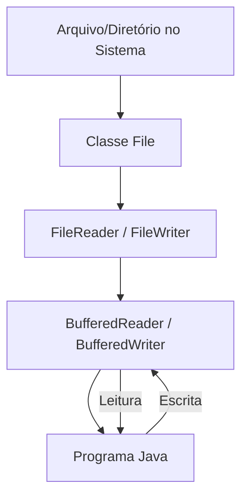

# 📄 Introdução ao I/O em Java

Este guia apresenta uma visão geral do **Input/Output (I/O)** em Java, com foco em como ler, escrever e manipular arquivos e diretórios.

---

## 📌 Conceito
Em Java, o pacote `java.io` fornece classes para trabalhar com entrada e saída de dados, permitindo operações como:
- Criar e excluir arquivos e pastas
- Ler e escrever dados
- Manipular informações sobre arquivos e diretórios

Essas operações podem ser feitas em diferentes níveis:
1. **Baixo nível** — leitura e escrita direta, caractere por caractere.
2. **Alto nível** — uso de buffers para maior eficiência e métodos utilitários.

---

## 🗂 Principais Classes

### **1. Classe `File`**
Representa arquivos e diretórios no sistema.
- Permite criar, excluir e renomear.
- Fornece informações como caminho, tamanho, data de modificação e permissões.
- Não manipula conteúdo, apenas metadados.

### **2. Classes de Leitura**
- **`FileReader`**: Lê caracteres de um arquivo de forma simples, adequado para textos curtos.
- **`BufferedReader`**: Envolve um `FileReader` e utiliza um buffer interno, permitindo leitura mais rápida e métodos como `readLine()`.

### **3. Classes de Escrita**
- **`FileWriter`**: Escreve caracteres em um arquivo, podendo sobrescrever ou acrescentar conteúdo.
- **`BufferedWriter`**: Envolve um `FileWriter` e utiliza um buffer, permitindo escrita mais eficiente e métodos como `newLine()` para quebras de linha.

---

## ⚙️ Funcionamento do Fluxo de I/O

O processo de leitura/escrita normalmente segue esta ordem:
1. Criar um objeto `File` que representa o destino (arquivo ou diretório).
2. Escolher a classe apropriada para leitura ou escrita (`FileReader`/`FileWriter` ou `BufferedReader`/`BufferedWriter`).
3. Realizar a operação desejada (ler ou escrever).
4. Fechar o recurso para liberar memória — preferencialmente com **try-with-resources**, que fecha automaticamente.

---

## 📊 Diagrama do Fluxo de I/O

- **File**: Ponte entre o programa e o sistema de arquivos.
- **FileReader / FileWriter**: Leitura e escrita básicas.
- **BufferedReader / BufferedWriter**: Otimização de desempenho e métodos adicionais.

---

## 💡 Boas Práticas
- Usar **`try-with-resources`** para garantir fechamento automático dos arquivos.
- Preferir **BufferedReader** e **BufferedWriter** para grandes volumes de dados.
- Sempre tratar exceções com `try-catch` para evitar falhas inesperadas.
- Verificar se o arquivo/diretório existe antes de tentar manipulá-lo.

---

## 📖 Referências
- [Documentação Java - java.io](https://docs.oracle.com/javase/8/docs/api/java/io/package-summary.html)
